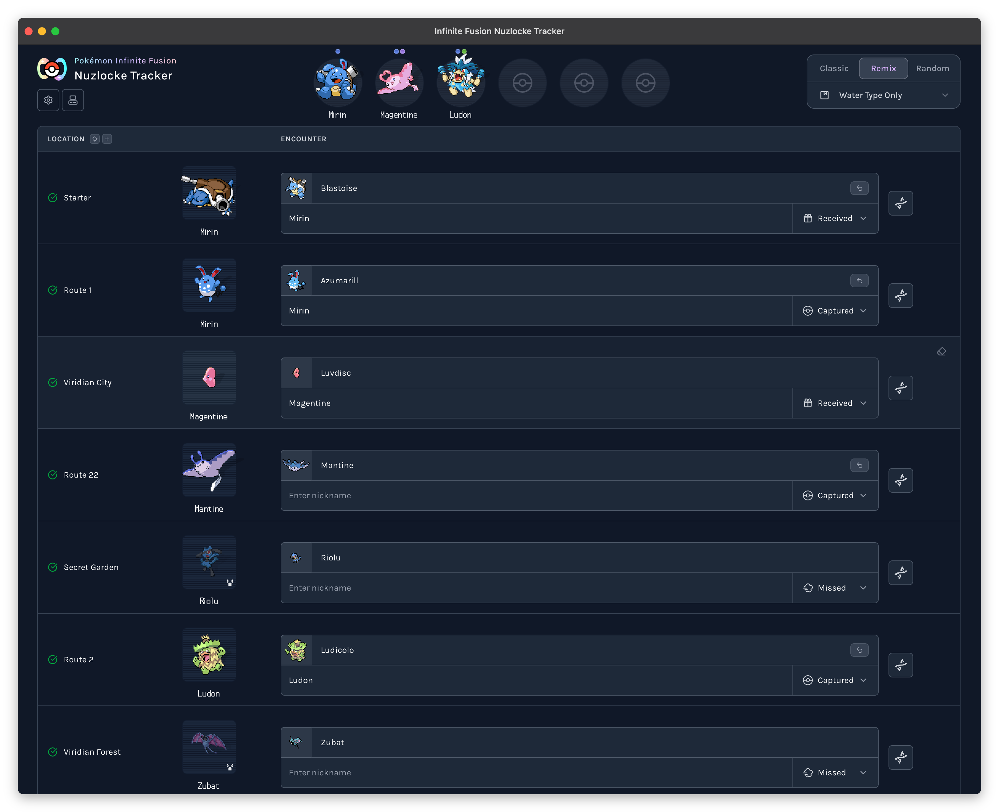

#  Infinite Fusion Nuzlocke Tracker

Track Pokemon Infinite Fusion Nuzlocke runs with encounter logging, team and box management.

[](https://nextjs.org/)
[](https://react.dev/)
[](https://github.com/millionco/react-doctor)
[](https://www.typescriptlang.org/)
[](LICENSE)
[](https://app.codecov.io/gh/fbosch/infinite-fusion-nuzlocke)
[](https://github.com/fallow-rs/fallow)

Live app: [fusion.nuzlocke.io](https://fusion.nuzlocke.io)  
Source: [github.com/fbosch/infinite-fusion-nuzlocke](https://github.com/fbosch/infinite-fusion-nuzlocke)

> [!NOTE]
> This project started as a way to explore agentic workflows, and I still use it as a playground for this.

---



## Features

- Encounter tracking by location with quick actions and sorting
- Playthrough profiles with create/switch/delete and import/export
- Classic, Remix, and Randomized game mode support
- Team, PC, and graveyard flows that preserve run-state invariants
- Fusion-aware encounter handling and custom locations

## Quick Start

Requirements:

- Node.js `24.x`
- Corepack-enabled pnpm `10.x`

```bash
corepack enable
corepack prepare pnpm@10 --activate
pnpm install --frozen-lockfile
pnpm dev
```

Open [http://localhost:4000](http://localhost:4000).

## Common Scripts

```bash
pnpm dev
pnpm build
pnpm start

pnpm type-check
pnpm lint
pnpm validate

pnpm test
pnpm test:run
pnpm test:coverage

devenv test

pnpm data:refresh
pnpm spritesheet
```

Scraper maintenance checks:

```bash
pnpm test:run tests/scrape-wild-encounters-wikitext.test.ts
pnpm scrape:encounters
pnpm exec biome format --write data --vcs-use-ignore-file=true --files-ignore-unknown=true
pnpm validate:route-articles
```

## Validation Workflow

For behavior or run-state changes, run checks in this order:

```bash
pnpm type-check
pnpm test:run
pnpm validate
```

## Contributing

Contributions are welcome via issues and pull requests.

## License

MIT License. See [`LICENSE`](LICENSE).
